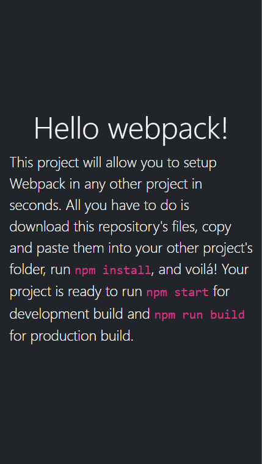

# Webpack setup

This is a simple yet powerful webpack boilerplate for later use as a starting point in other projects. It includes an HTML template, a JS file and a CSS that's imported by the JS file. To build it yourself, you may follow these [steps](https://github.com/microverseinc/curriculum-javascript/blob/main/todo-list/exercises/exercise_set_up_project_with_webpack.md).

## Mobile

## Built With

- Webpack
- HTML5
- CSS3
- ES6
- Node.js
- Visual Studio Code
- Git & GitHub

## Getting Started

To get Webpack up and running in another project, follow these simple steps:

1. Clone the repository into your machine (Or download .zip file and extract).
2. Open the project's folder.
3. Copy and paste all files and folders except app_screenshot.png, MIT.md and README.md into the other project's root folder.
4. Run npm start

### Prerequisites

Any modern web browser will do. Any source-code editor (VSCode recommended).

### Setup

Follow the steps described before.

## Authors

👤 **Dico Diaz Dussan**

- GitHub: [@dicodiaz](https://github.com/dicodiaz)
- Twitter: [@DicoDiaz1](https://twitter.com/DicoDiaz1)
- LinkedIn: [Dico Diaz Dussan](https://www.linkedin.com/in/dico-diaz-dussan-476106a6/)

## 🤝 Contributing

Contributions, issues, and feature requests are welcome!

Feel free to check the [issues page](../../issues/).

## Show your support

Give a ⭐️ if you like this project!

## Acknowledgments

- Hat tip to anyone whose code was used
- Inspiration
- Microverse program
- My code reviewers

## 📝 License

This project is [MIT](./MIT.md) licensed.
