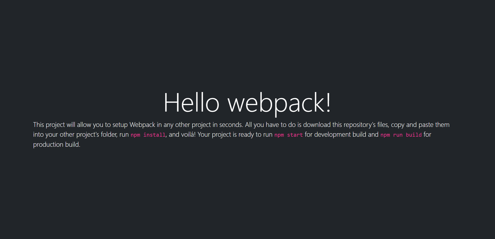

# Webpack setup

This is a simple yet powerful webpack boilerplate for later use as a starting point in other projects. It includes an HTML template, a JS file, and a CSS that's imported by the JS file. To build it yourself, you may follow these [steps](https://github.com/microverseinc/curriculum-javascript/blob/main/todo-list/exercises/exercise_set_up_project_with_webpack.md).

## Mobile

## Desktop

## Built With

- HTML
- Bootstrap
- JavaScript
- Webpack
- VSCode
- Gitflow & GitHub

## Live Demo

[Live Demo Link](https://dicodiaz.me/webpack-setup/)

## Getting Started

To get Webpack up and running in another project, follow these simple steps:

1. Clone the repository into your machine (Or download the .zip file and extract).
2. Open the project's folder.
3. Copy and paste all files and folders except app_screenshot.png, MIT.md, and README.md into the other project's root folder.
4. Run `npm install`
5. Run `npm start`

### Considerations

- Intended only for use as a starting point in other projects. Do not copy and paste these files into more mature projects as this will overwrite your package.json and package-lock.json files.
- This project also includes Bootstrap for styling and Jest for testing.
- Remember to run `npm run build` before pushing to GitHub so that your last changes apply to your GitHub Pages deployed website.
- You may also run `npm run deploy` so that your website URL doesn't require adding `/dist` at the end of it. Remember to deploy your GitHub Pages website from the gh_pages branch after you do this so it works.

### Setup

Follow the steps described before.

## Authors

👤 **Dico Diaz Dussan**

- GitHub: [@dicodiaz](https://github.com/dicodiaz)
- LinkedIn: [Dico Diaz Dussan](https://www.linkedin.com/in/dico-diaz-dussan/)
- Portfolio: [dicodiaz.com.co](https://dicodiaz.com.co)

## 🤝 Contributing

Contributions, issues, and feature requests are welcome!

Feel free to check the [issues page](../../issues/).

## Show your support

Give a ⭐️ if you like this project!

## 📝 License

This project is [MIT](./MIT.md) licensed.
